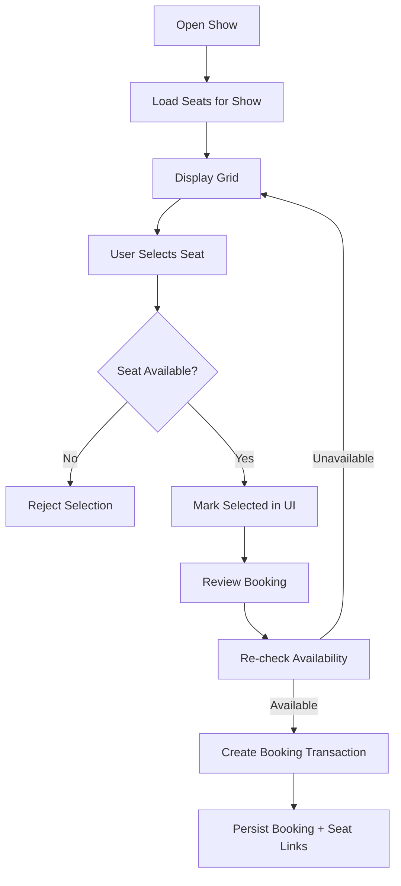

# Seat Booking Flow

Duplicate protection: service validation **and** DB uniqueness constraint on (show, seat) inside the transaction. Exact constraint documented in `docs/08-database/schema.md` (Phase 03).
