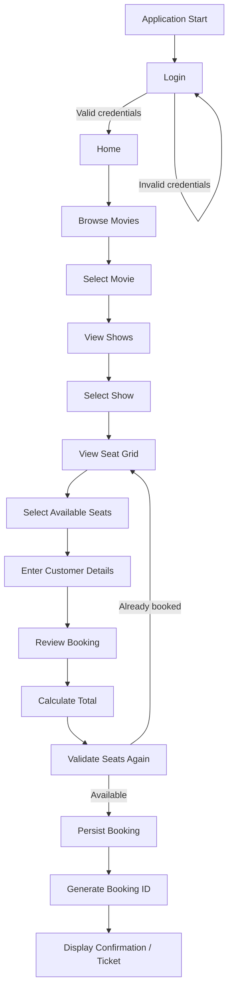

# System Flow

```mermaid
flowchart TD
    A[Application Start] --> B[Login]
    B -->|Valid credentials| C[Home]
    B -->|Invalid credentials| B
    C --> D[Browse Movies]
    D --> E[Select Movie]
    E --> F[View Shows]
    F --> G[Select Show]
    G --> H[View Seat Grid]
    H --> I[Select Available Seats]
    I --> J[Enter Customer Details]
    J --> K[Review Booking]
    K --> L[Calculate Total]
    L --> M[Validate Seats Again]
    M -->|Available| N[Persist Booking]
    M -->|Already booked| H
    N --> O[Generate Booking ID]
    O --> P[Display Confirmation / Ticket]
```
