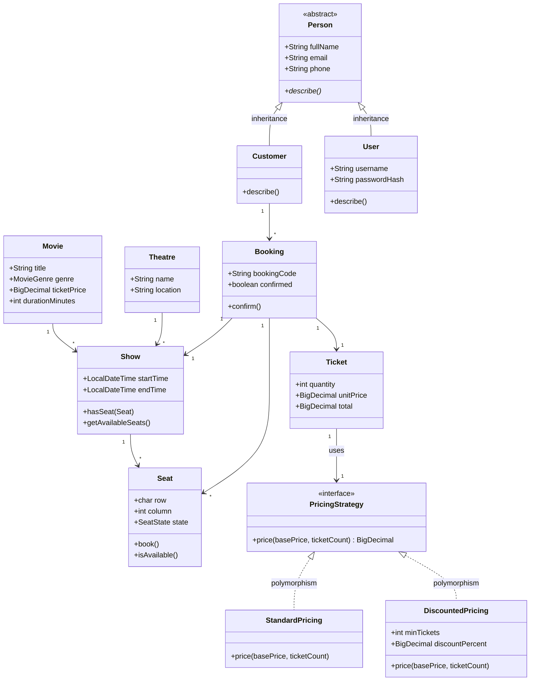

# OOP Design

The system demonstrates OOP for real design reasons — no artificial hierarchies.

## Where each OOP concept is demonstrated

| Concept | Demonstration | Rationale |
|---|---|---|
| Class | Movie, Theatre, Show, Seat, Customer, User, Booking, Ticket | Domain entities with state and behavior |
| Object | Instances of every class, composed into shows/bookings | Objects interact through behavior, e.g. `Booking.confirm()` marks `Seat`s booked |
| Inheritance | `Person` (abstract) → `Customer`, `User` | Genuine `is-a`: both are people sharing identity/contact fields; each refines `describe()` |
| Polymorphism | `PricingStrategy` interface with `StandardPricing`, `DiscountedPricing`; delegated through `Ticket` | `Ticket` calls a strategy without knowing its type; runtime choice changes totals (REQ-10) |

Detail: [classes.md](classes.md), [inheritance.md](inheritance.md), [polymorphism.md](polymorphism.md).