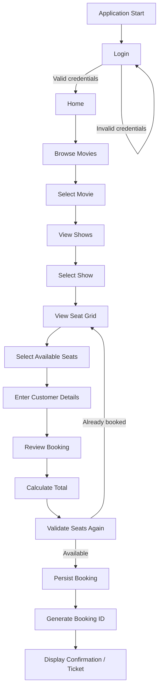
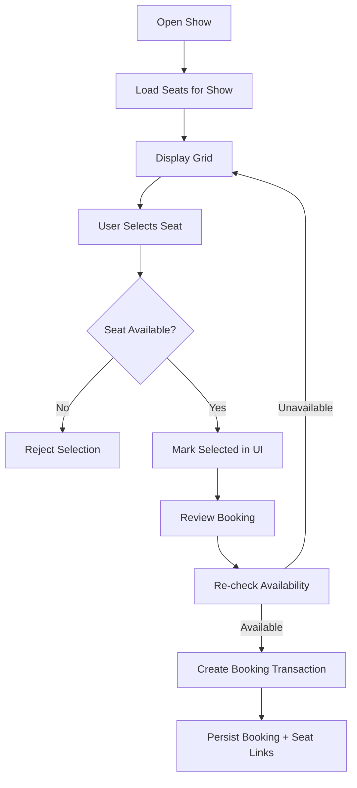

# Movie Ticket Booking System — Final Implementation Plan

> **Purpose:** Authoritative implementation blueprint for OpenCode.
>
> **Implementation rule:** Implement exactly **one phase at a time**. After a phase is implemented, tested, reviewed, documented, committed, and pushed, **stop**. The next phase starts only after the current phase is verified.

---

## 1. Project Identity

**Project:** Movie Ticket Booking System  
**Language:** Java 17  
**UI:** JavaFX  
**Build:** Maven  
**Persistence:** SQLite  
**Database access:** JDBC  
**Testing:** JUnit 5  
**Application:** Single-user local desktop application  
**Authentication:** Required  
**Initial data:** Seeded movies, theatres, shows, and seats  
**Seat layout:** Simple row/column grid  
**VIP seats:** Not required  
**Payment:** Not required  
**Ticket output:** On-screen confirmation  
**Admin management:** Not required initially  
**GitHub:** https://github.com/adithya-1010010/java_project.git  
**Current implementation:** None; `context.md` is the only existing project content.

The original functional requirements include browsing movies, viewing genres/prices, managing show timings, entering customer details, calculating ticket cost, preventing duplicate seat bookings, and displaying a booking ID with ticket details. The original context also explicitly identifies Home, Movie, Booking, Ticket, Confirmation, and OOP-related modules. 

---

# 2. Source of Truth Hierarchy

OpenCode must use the following order when resolving information:

1. `context.md` — original project requirements.
2. `docs/13-reference/memory.md` — confirmed decisions and project history.
3. `docs/02-requirements/requirements.md` — normalized requirement IDs.
4. `docs/04-architecture/architecture.md` — approved architecture.
5. `docs/03-planning/implementation-plan.md` — current implementation instructions.
6. Relevant phase/module documentation.
7. Existing source code and tests.

If two sources conflict, do **not** silently choose one. Record the conflict in `memory.md` and stop for resolution unless the newer documented decision clearly supersedes the older one.

---

# 3. Target Documentation Structure

```text
java_project/
├── README.md
├── context.md
│
├── docs/
│   ├── 01-overview/
│   │   ├── overview.md
│   │   ├── objectives.md
│   │   └── scope.md
│   │
│   ├── 02-requirements/
│   │   ├── requirements.md
│   │   ├── functional-requirements.md
│   │   ├── non-functional-requirements.md
│   │   └── assumptions-and-constraints.md
│   │
│   ├── 03-planning/
│   │   ├── plan.md
│   │   ├── roadmap.md
│   │   ├── phases.md
│   │   └── implementation-plan.md
│   │
│   ├── 04-architecture/
│   │   ├── architecture.md
│   │   ├── system-design.md
│   │   ├── component-design.md
│   │   └── technology-stack.md
│   │
│   ├── 05-flows/
│   │   ├── system-flow.md
│   │   ├── booking-flow.md
│   │   ├── seat-booking-flow.md
│   │   └── confirmation-flow.md
│   │
│   ├── 06-modules/
│   │   ├── home-module.md
│   │   ├── movie-module.md
│   │   ├── booking-module.md
│   │   ├── ticket-module.md
│   │   └── confirmation-module.md
│   │
│   ├── 07-oop/
│   │   ├── oop-design.md
│   │   ├── classes.md
│   │   ├── inheritance.md
│   │   └── polymorphism.md
│   │
│   ├── 08-database/
│   │   ├── database-design.md
│   │   ├── schema.md
│   │   └── data-flow.md
│   │
│   ├── 09-ui/
│   │   ├── ui-design.md
│   │   ├── screen-flow.md
│   │   └── screens.md
│   │
│   ├── 10-testing/
│   │   ├── testing-strategy.md
│   │   ├── test-plan.md
│   │   └── test-cases.md
│   │
│   ├── 11-development/
│   │   ├── development-workflow.md
│   │   ├── coding-guidelines.md
│   │   └── git-workflow.md
│   │
│   ├── 12-phases/
│   │   ├── phase-01.md
│   │   ├── phase-02.md
│   │   ├── phase-03.md
│   │   └── ...
│   │
│   └── 13-reference/
│       ├── memory.md
│       ├── glossary.md
│       ├── troubleshooting.md
│       └── future-improvements.md
│
└── src/
    ├── main/
    └── test/
```

Not every documentation file must contain large amounts of prose. Keep documents useful, current, and linked from `README.md`.

---

# 4. Core Documentation Roles

## `overview.md` — Human-Friendly Project Overview

This is the beautiful, concise project overview. It should answer in a few minutes:

- What is the project?
- What problem does it solve?
- What can the user do?
- What technology is used?
- How is the system structured?
- What are the major modules?
- What are the OOP concepts?
- What are the implementation phases?
- What is the current status?

Use clean headings, tables, Mermaid diagrams where useful, and links to deeper documentation.

## `implementation-plan.md` — OpenCode Execution Blueprint

This file is the operational plan in this document. It defines what must be implemented, in what order, and how each phase is completed.

## `memory.md` — Persistent Engineering Memory

This is the anti-hallucination source of truth. It must contain:

- confirmed requirements;
- confirmed technical decisions;
- architecture decisions and rationale;
- class/design decisions;
- database decisions;
- UI decisions;
- completed/current/next phase;
- important discoveries;
- problems and final resolutions;
- changes to previous decisions;
- deviations from the plan;
- known limitations.

Every phase must update `memory.md` before its Git commit.

---

# 5. Final Architecture

Use a simple layered architecture with clear responsibility boundaries.

```text
                     JavaFX UI
                        │
                        ▼
                  Controllers
                        │
                        ▼
                    Services
                /       │       \
               /        │        \
              ▼         ▼         ▼
          Domain     Validation   DTO/View data
              │
              ▼
        Repository / DAO
              │
              ▼
            JDBC
              │
              ▼
           SQLite
```

## Package direction

```text
com.movieticketbooking
├── Main / Application entry point
├── config
├── controller
├── model
├── repository
├── service
├── validation
├── util
└── view
```

The exact package names may be finalized during Phase 1, but the responsibilities must remain separated.

### Responsibility rules

**Model:** domain state and domain relationships.  
**Repository/DAO:** database access only.  
**Service:** business rules and orchestration.  
**Validation:** input/business validation that benefits from isolation and testing.  
**Controller:** translates JavaFX UI events into application operations and updates views.  
**View:** JavaFX screens and presentation.  
**Config/Util:** narrowly scoped infrastructure helpers; avoid turning `Util` into a dumping ground.

---

# 6. Proposed Domain Model

The exact class list is to be confirmed in Phase 1 architecture documentation, but the core domain should be centered around:

```text
Movie
Theatre
Show
Seat
Customer
Booking
Ticket
User / Credential representation
```

Likely relationships:

```text
Movie 1 ─── * Show
Theatre 1 ─── * Show
Show 1 ─── * Seat
Customer 1 ─── * Booking
Booking 1 ─── 1 Show
Booking 1 ─── * Seat
Booking 1 ─── 1 Ticket
User 1 ─── * Booking   (if booking is associated with authenticated user)
```

Do not add unnecessary domain entities until a requirement or design need justifies them.

---

# 7. OOP Design Goals

The system must demonstrate OOP for a real design reason.

## Class and objects

Domain entities such as Movie, Show, Seat, Booking, and Ticket should have clear state and behavior.

## Inheritance

Use inheritance only where a genuine `is-a` relationship exists. One possible academically meaningful area is a small hierarchy around ticket presentation/booking behavior if the final requirements justify it; otherwise, use another real hierarchy rather than artificial inheritance.

## Polymorphism

Demonstrate polymorphism through a meaningful abstraction, such as a shared service/interface/repository contract or a real domain hierarchy. Do not create an artificial parent class solely to claim polymorphism.

The final class diagram must explicitly label where class, object, inheritance, and polymorphism are demonstrated.

---

# 8. Database Design Target

Use SQLite as the local persistent database.

The final schema should cover at minimum the confirmed information needed for:

- authenticated users;
- movies;
- theatres/screens;
- shows;
- seats and their layout/state;
- customers/bookers, if stored separately from authenticated users;
- bookings;
- booked seats / booking-seat relationships.

A normalized relationship is preferred over storing a whole booking as one serialized text blob.

## Important booking rule

A seat must not be bookable twice for the same show.

This should be protected at both levels where practical:

1. application/service validation;
2. database constraint/transaction strategy.

The database design must document the exact uniqueness rule, e.g. the combination of show and seat identity that constitutes a duplicate booking.

---

# 9. User Flow



## Seat booking flow



---

# 10. UI Screen Plan

Target screens:

1. Login screen
2. Home/dashboard screen
3. Movie listing screen
4. Show selection screen
5. Seat selection screen
6. Customer details / booking details screen
7. Booking summary screen
8. Booking confirmation/ticket screen

The UI should remain visually clean and understandable rather than over-engineered.

Every screen must document:

- purpose;
- controls;
- inputs;
- validation;
- navigation destination;
- controller;
- service calls;
- data loaded.

---

# 11. Implementation Phases

## Phase 01 — Project Foundation and Documentation

### Goal
Create the Maven Java 17 JavaFX project skeleton and establish the engineering/documentation foundation.

### Work
- Create/validate Maven project.
- Configure Java 17.
- Configure JavaFX.
- Configure JUnit 5.
- Add SQLite/JDBC dependency.
- Create package structure.
- Create application entry point.
- Make a minimal JavaFX window launch successfully.
- Create the documentation structure.
- Create `README.md`.
- Create `overview.md`.
- Create `memory.md`.
- Create requirements/architecture/phase documentation skeletons.

### Tests
- Maven build succeeds.
- Application starts.
- JavaFX window opens.
- Test framework executes a basic test.

### Completion
No application features beyond the foundation should be implemented.

### Git
Commit: `phase-01: initialize JavaFX Maven project and project documentation`

Push only after build/test success.

---

## Phase 02 — Domain Model and OOP Foundation

### Goal
Implement the core domain objects and the initial OOP design.

### Work
- Implement confirmed core model classes.
- Define relationships and constructors/accessors as appropriate.
- Define enums/value types only where useful.
- Implement meaningful inheritance/polymorphism based on the final OOP design.
- Write unit tests for domain invariants.
- Document class relationships in `docs/07-oop/`.

### Tests
- Object creation.
- Relationships.
- Basic validation/invariants.
- Polymorphic behavior.

### Completion
Domain model exists without database dependence.

### Git
Commit: `phase-02: implement core domain model and OOP foundation`

---

## Phase 03 — SQLite Database and Persistence Foundation

### Goal
Create persistent storage and a clean database access layer.

### Work
- Implement database configuration.
- Implement connection management.
- Create schema initialization/migration mechanism appropriate for the project size.
- Create required tables and constraints.
- Implement seed data.
- Implement repository/DAO foundations.
- Verify create/read/update operations needed by current requirements.
- Document schema and data flow.

### Tests
- Database initializes from a clean state.
- Required tables exist.
- Seed data loads.
- Basic persistence works across application restarts.
- Uniqueness constraint for booked seats behaves as designed.

### Git
Commit: `phase-03: add SQLite schema seed data and persistence layer`

---

## Phase 04 — Authentication

### Goal
Implement the confirmed login requirement.

### Work
- Add user/credential storage according to the approved schema.
- Seed a safe development/demo account mechanism without hardcoding secrets into source code unnecessarily.
- Implement authentication service.
- Implement login UI.
- Validate invalid credentials.
- Provide successful navigation to the application home screen.
- Keep authentication local and appropriate for the single-user academic scope.

### Tests
- Valid credentials.
- Invalid credentials.
- Empty fields.
- Failed login does not enter the application.

### Git
Commit: `phase-04: implement local authentication and login flow`

---

## Phase 05 — Movie and Show Modules

### Goal
Make the core catalog usable.

### Work
- Movie repository/service.
- Theatre/show repository/service.
- Movie listing UI.
- Movie detail information.
- Genre and ticket price display.
- Show timing selection.
- Navigation from movie to show selection.

### Tests
- Movies load from SQLite.
- Correct movie metadata displays.
- Shows are filtered/associated with the selected movie.
- Invalid/empty data states are handled.

### Git
Commit: `phase-05: implement movie theatre and show modules`

---

## Phase 06 — Seat Management

### Goal
Implement the row/column seat grid and seat availability behavior.

### Work
- Load seats for the selected show.
- Render the seat grid.
- Distinguish available and unavailable seats.
- Allow selection of available seats.
- Prevent selection of unavailable seats.
- Track current selections.
- Create service/repository operations for seat availability.

### Tests
- Correct seat count/layout.
- Available seats selectable.
- Booked seats blocked.
- Multiple seat selection.
- Deselection.
- Invalid seat state handled.

### Git
Commit: `phase-06: implement seat grid and availability management`

---

## Phase 07 — Booking and Ticket Calculation

### Goal
Implement the actual booking business logic.

### Work
- Customer details handling.
- Booking service.
- Selected-show validation.
- Selected-seat validation.
- Ticket quantity calculation.
- Total price calculation.
- Booking summary model/view.
- Ensure booking logic uses a transaction for final persistence.
- Re-check seat availability immediately before persistence.
- Generate booking ID.

### Tests
- Single-ticket booking.
- Multiple-ticket booking.
- Correct total cost.
- Missing customer details.
- No selected seats.
- Duplicate seat race/check at final persistence layer.
- Booking is not partially persisted after failure.

### Git
Commit: `phase-07: implement booking workflow and ticket calculation`

---

## Phase 08 — Complete Confirmation / Ticket Module

### Goal
Complete the end-to-end user experience.

### Work
- Confirmation screen.
- Booking ID display.
- Movie/show/theatre details.
- Selected seats.
- Customer details.
- Ticket quantity.
- Total cost.
- Navigation/reset behavior for a new booking.

### Tests
- Confirmation data matches saved booking.
- Booking ID displayed.
- New booking can start cleanly after confirmation.

### Git
Commit: `phase-08: complete booking confirmation and ticket display`

---

## Phase 09 — End-to-End Integration and Validation

### Goal
Verify the complete system as one application.

### Work
Run and verify:

```text
Login
  ↓
Home
  ↓
Movie
  ↓
Show
  ↓
Seat
  ↓
Customer
  ↓
Summary
  ↓
Booking
  ↓
Confirmation
```

Test persistence after restart.
Test duplicate seat protection.
Test invalid input paths.
Test empty states.
Test database failure behavior where practical.

### Tests
- End-to-end happy path.
- Invalid login.
- Invalid booking inputs.
- Duplicate seat booking.
- Restart/persistence test.
- Regression suite.

### Git
Commit: `phase-09: integrate and validate complete booking flow`

---

## Phase 10 — Quality, Polish, Documentation, and Final Acceptance

### Goal
Finalize the academic project without adding new scope.

### Work
- Refactor only where justified.
- Remove dead code.
- Improve validation/messages.
- Improve JavaFX layout consistency.
- Ensure naming and package conventions are clean.
- Complete README.
- Complete documentation links.
- Finalize OOP explanation.
- Finalize database documentation.
- Finalize testing documentation.
- Update troubleshooting and future improvements.
- Update `memory.md` with final project state.

### Tests
Run the complete JUnit suite and manual acceptance checklist.

### Git
Commit: `phase-10: finalize quality documentation and project acceptance`

Push final state.

---

# 12. Phase Completion Protocol

OpenCode must perform this exact sequence for every phase:

```text
1. Read context.md
2. Read memory.md
3. Read the architecture documents
4. Read the current phase document
5. Check the current Git status
6. Implement ONLY the current phase
7. Run automated tests
8. Perform the phase's manual verification
9. Review the diff
10. Update documentation
11. Update memory.md
12. Update phase status
13. Run a final build/test check
14. git add <relevant files>
15. git commit -m "<phase commit>"
16. git push
17. Verify the push succeeded
18. STOP
```

OpenCode must not start the next phase automatically.

---

# 13. Anti-Hallucination Rules

OpenCode must obey these rules:

1. Never invent a missing requirement.
2. Never silently change a confirmed technology choice.
3. Never add a library because it is convenient unless it is documented and justified.
4. Never implement a later phase early.
5. Always check `memory.md` before significant design decisions.
6. Always preserve previously approved architecture unless a change is explicitly documented.
7. When uncertain between two valid approaches, stop and ask instead of guessing.
8. When a bug requires a design change, record it in `memory.md`.
9. Never claim a test passed without actually running it.
10. Never claim a Git push succeeded without verifying it.
11. Do not delete or rewrite working features without a documented reason.
12. Keep the application within the confirmed academic scope.

---

# 14. Requirement Traceability

Every requirement must map to implementation and tests.

Recommended format:

| Requirement | Module | Implementation | Phase | Tests |
|---|---|---|---|---|
| Browse movies | Movie | Movie service/repository + UI | 05 | Movie tests |
| View genres/prices | Movie | Movie model/service/UI | 05 | Movie tests |
| Select show | Booking/Show | Show service/UI | 05 | Show tests |
| Enter customer details | Booking | Booking form/service | 07 | Validation tests |
| Calculate total cost | Ticket | Ticket/booking service | 07 | Calculation tests |
| Prevent duplicate seats | Seat/Booking | Service + DB constraint/transaction | 06–07 | Seat tests |
| Booking ID | Confirmation | Booking service | 07–08 | Booking tests |
| Complete ticket details | Confirmation | Confirmation view | 08 | Integration tests |
| Class/object/inheritance/polymorphism | OOP | Domain/application design | 02 onward | OOP/domain tests |

The exact final mapping must be stored in `requirements.md` and `test-cases.md`.

---

# 15. Final Acceptance Criteria

The project is complete only when all of the following are true:

- The application starts successfully using the documented Maven command.
- Login works according to the confirmed requirement.
- Movies can be browsed.
- Genre and ticket price information is displayed.
- Shows can be selected.
- Seats are displayed in the row/column layout.
- Unavailable seats cannot be selected.
- Duplicate seat bookings are prevented.
- Customer details can be entered and validated.
- Ticket total is calculated correctly.
- Booking is persisted in SQLite.
- Data survives application restart.
- A booking ID is generated.
- Confirmation displays complete ticket details.
- Required OOP concepts are meaningfully demonstrated.
- JUnit 5 tests pass.
- End-to-end manual verification passes.
- Documentation is complete and linked from the README.
- `memory.md` accurately reflects the final architecture and decisions.
- Every phase has its own meaningful Git commit.
- Every completed phase has been pushed to GitHub.
- No phase was implemented out of order.

---

# 16. Final Instruction to OpenCode

Before implementing anything:

```text
READ:
context.md
memory.md
requirements.md
architecture.md
technology-stack.md
implementation-plan.md

THEN:
Implement only the currently assigned phase.

DO NOT:
Guess.
Skip tests.
Implement future phases.
Change architecture silently.
Add unnecessary dependencies.
Claim unverified success.

AFTER THE PHASE:
Test → Review → Document → Update memory.md → Commit → Push → STOP.
```

This plan is the **implementation contract**. Any necessary deviation must be explicitly documented before it becomes part of the project.
